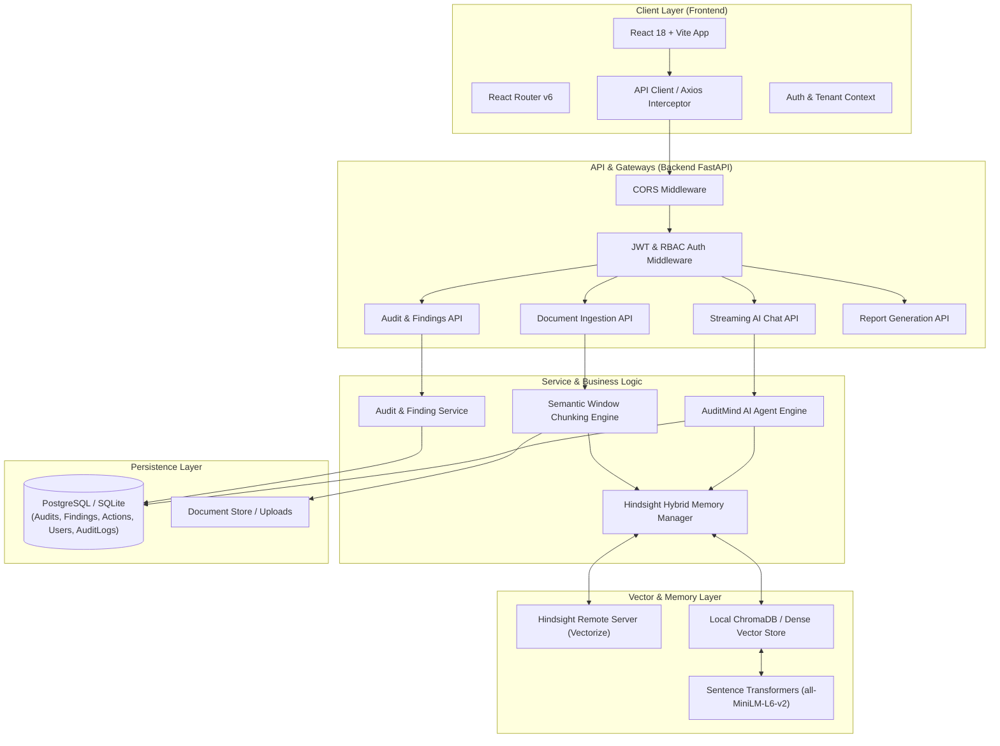
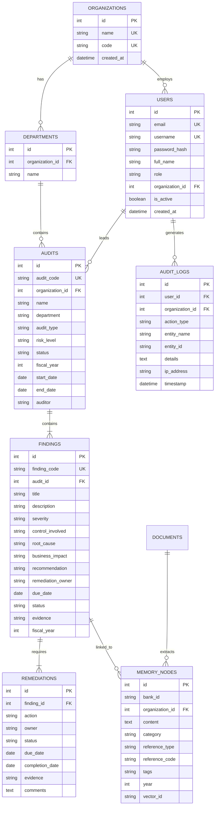
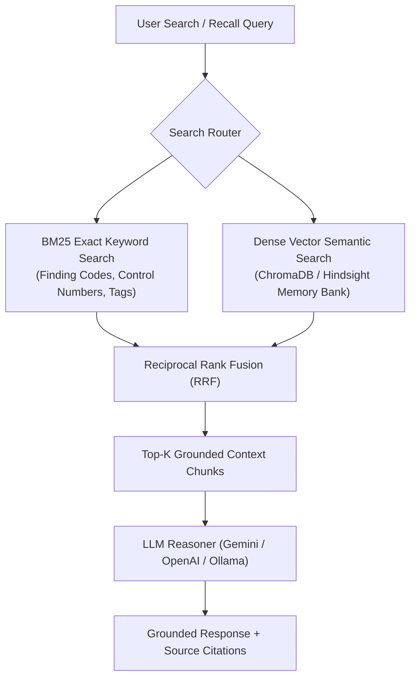

# AuditMind — Production Architecture Specifications (Phase 0)

> **Document Status**: Architectural Specification Baseline  
> **System Name**: AuditMind (AI Compliance & Audit Organizational Memory Platform)  

---

## 1. System Topology & Data Flow



---

## 2. Layered Backend Architecture

To ensure maintainability and testability, the backend is organized into explicit domain layers:

```text
HTTP Request
    │
    ▼
[ API Controller / Router ]   <── Handles HTTP status codes, request schemas
    │
    ▼
[ Service Layer ]              <── Executes business rules, orchestration, AI prompt formatting
    │
    ▼
[ Repository Layer ]           <── Encapsulates database queries & persistence
    │
    ▼
[ Data Storage / ORM ]        <── SQLAlchemy models & PostgreSQL/SQLite DB
```

---

## 3. Persistent Data Model Specifications



---

## 4. Hybrid Search & Memory Layer Architecture



---

## 5. Security & Isolation Model

1. **Authentication**: OAuth2 Password Flow + JWT Bearer Tokens with HS256 / RS256 signatures.
2. **Authorization**: Dependency-injected role checking (`@require_roles(["Admin", "Lead Auditor"])`).
3. **Data Isolation**: All queries enforced with `organization_id` filter (Multi-tenant context).
4. **Audit Immutability**: `AuditLog` records append-only; standard users cannot modify or purge logs.
