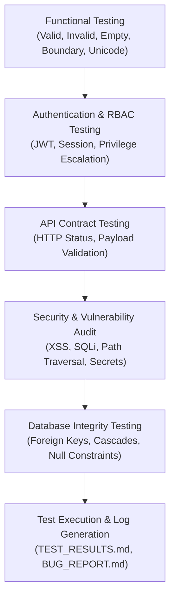

# AuditMind — Comprehensive QA Master Test Plan

> **Role**: Senior QA Engineer & Lead Application Tester  
> **Target Repository**: `https://github.com/bharathsahu/auditmind.git`  
> **Date**: September 29, 2026  

---

## 1. Application Discovery & Architecture Overview

### Technology Stack
- **Frontend Framework**: React 18, Vite 5, Tailwind CSS v3, React Router v6, Axios, Lucide Icons.
- **Backend Framework**: Python 3.11+, FastAPI, Uvicorn, Pydantic v2.
- **Database Layer**: SQLite (local development / testing), PostgreSQL (production Docker compose setup), SQLAlchemy 2.0 ORM, Alembic migrations.
- **Authentication & Security**: OAuth2 Bearer password flow, signed JWT access tokens (HS256 algorithm), salted SHA-256 password hashing, RBAC dependencies (`Admin`, `Executive`, `Lead Auditor`, `Auditor`).
- **Memory & Intelligence Layer**: Hindsight Memory Engine API, Dense Term Vector similarity, BM25 exact code search, Reciprocal Rank Fusion (RRF $k=60$).
- **Export & Reports Engine**: Python `docx` (Word report generation), CSV streaming.

---

## 2. API Endpoints Map

| Endpoint | Method | Role Required | Description |
| :--- | :--- | :--- | :--- |
| `/api/auth/login` | POST | Public | Authenticates credentials & returns signed JWT token |
| `/api/auth/me` | GET | Authenticated | Retrieves profile of logged-in user |
| `/api/auth/logs` | GET | Admin, Lead Auditor | Retrieves immutable compliance audit logs |
| `/api/audits` | GET, POST | Authenticated / Auditor | Retrieves audit scopes & creates new audit |
| `/api/audits/{id}` | GET, PUT | Authenticated / Lead Auditor | Retrieves or updates specific audit scope |
| `/api/findings` | GET, POST | Authenticated / Auditor | Retrieves findings & creates new finding |
| `/api/findings/similar` | POST | Authenticated | Performs Hindsight recall for similar historical findings |
| `/api/findings/analysis/recurring` | GET | Authenticated | Aggregates recurring control failures across fiscal years |
| `/api/remediations` | GET | Authenticated | Retrieves active remediation items |
| `/api/remediations/{id}/status` | PUT | Auditor | Updates remediation status & completion date |
| `/api/documents/upload` | POST | Auditor | Uploads file, computes SHA-256 hash, chunks text & retains memory |
| `/api/ai/chat` | POST | Authenticated | Grounded AI assistant chat with citations |
| `/api/ai/stream` | POST | Authenticated | SSE streaming AI chat answer tokens |
| `/api/hindsight/memories` | GET | Authenticated | Lists memory nodes |
| `/api/hindsight/graph` | GET | Authenticated | Returns interactive graph nodes, links & lineage chains |
| `/api/reports/summary` | GET | Authenticated | Returns executive dashboard metrics |
| `/api/reports/docx` | GET | Executive, Lead Auditor | Downloads Word `.docx` executive report |
| `/api/reports/csv` | GET | Auditor | Downloads CSV findings export |

---

## 3. Comprehensive Testing Strategy

1. **Functional & Edge Case Validation**: Execute boundary value analysis, malformed input testing, and Unicode payloads.
2. **Security & Vulnerability Assessment**: Audit for SQL injection, path traversal, XSS, token tampering, and IDOR.
3. **Database Integrity Audit**: Verify foreign key cascades, unique constraints, and transaction rollback behavior.
4. **Execution & Reporting**: Run automated test suites (`pytest`), record actual responses, and summarize in `TEST_RESULTS.md` and `BUG_REPORT.md`.
